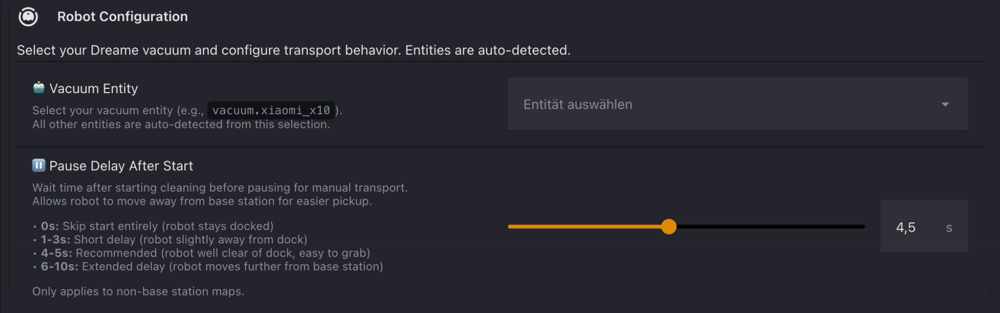
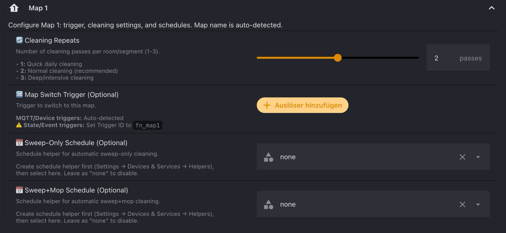
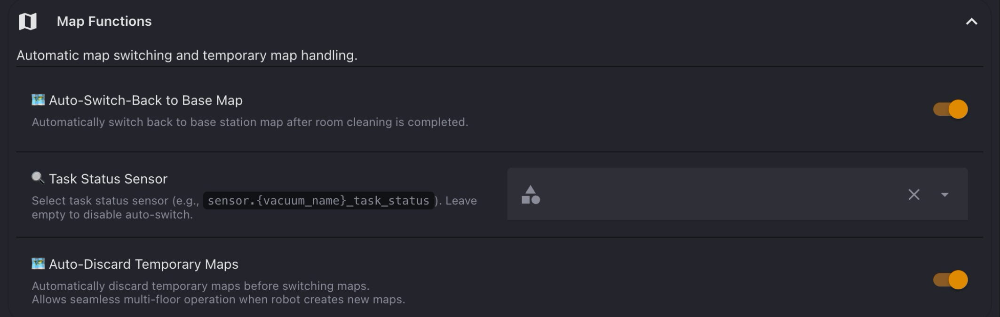
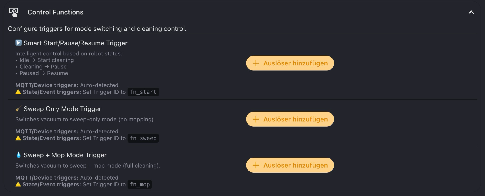
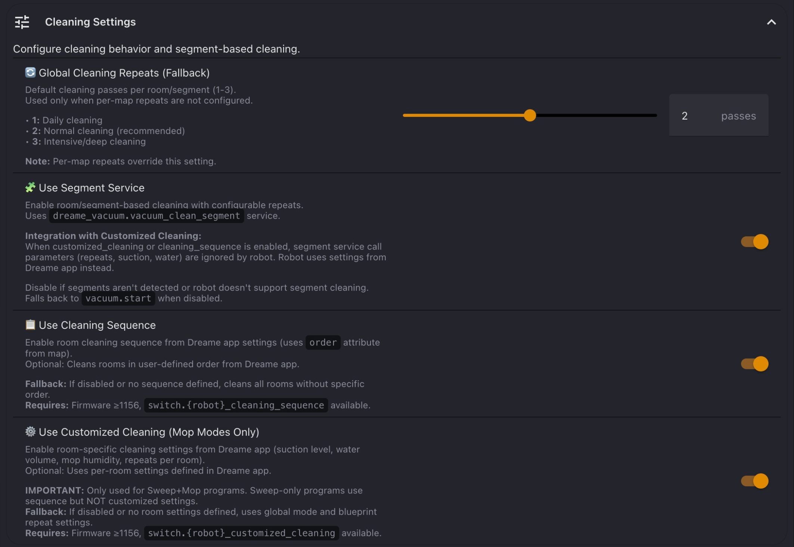
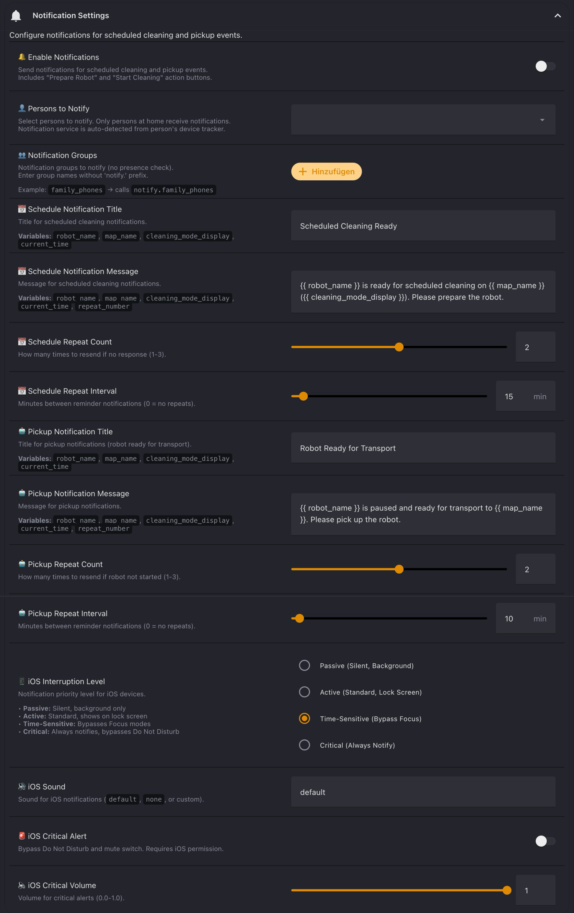
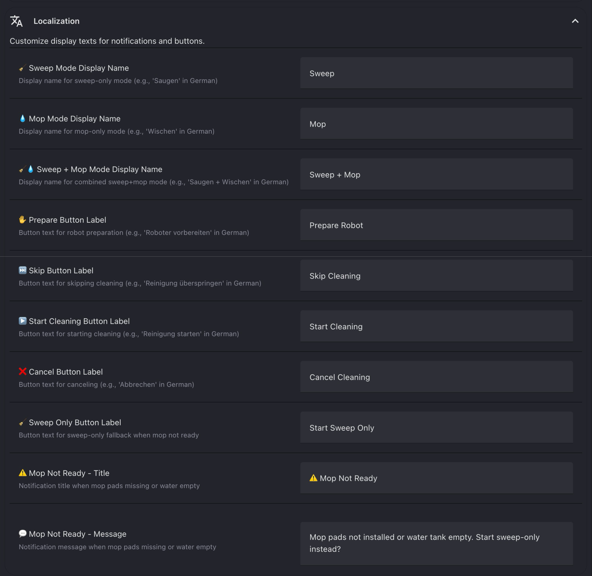
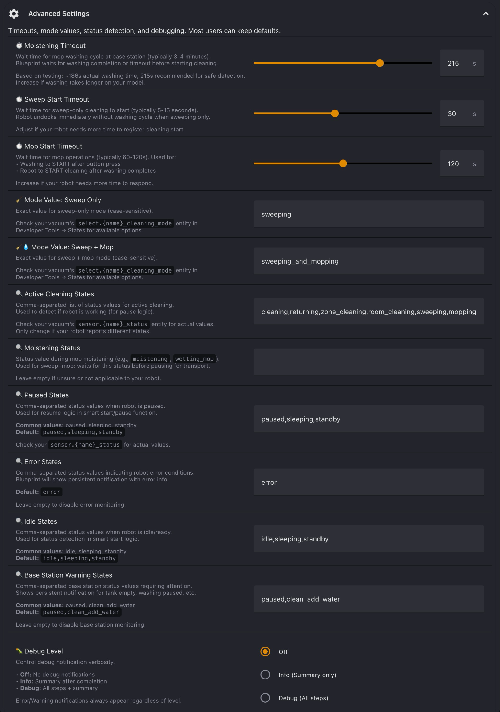

# Configuration Guide

Configuration reference for Dreame Vacuum Multi-Floor Control blueprint.

**Prerequisites:**
- Dreame Vacuum Integration ≥ v2.0.0b21
- At least one saved map

**See also:** [Features & Installation](README.md)

---

## 🤖 Robot Configuration



### 🤖 Vacuum Entity

Select your vacuum entity (e.g., `vacuum.robot_name`). This is the only required configuration - all other entities are automatically detected:
- Status sensor: `sensor.*_status`
- Cleaning mode: `select.*_cleaning_mode`
- Selected map: `select.*_selected_map`
- Map camera: `camera.*_map`

The blueprint extracts the base name and builds entity IDs automatically.

### ⏸️ Pause Delay After Start
**Default:** 4.5s (range: 0-10s)

Time robot moves away from dock before pausing for manual transport.

**Behavior:**
- Robot starts cleaning and undocks
- Waits specified time
- Automatically pauses for pickup
- Only applies to non-base-station maps

**Recommended values:**
- `0s`: Skip start entirely (robot stays docked)
- `4-5s`: Robot moves clear of dock (easy to grab)
- `6-10s`: Extended distance from base station

---

## 🏠 Map 1 / Map 2 / Map 3 / Map 4



### 🏷️ Map Name
**Default:** empty (fall back to the map in slot N)

Name of the map this section configures, exactly as shown in
`select.{robot}_selected_map`.

**Why this exists:** map slots are an index into the ordered list of saved maps. When the
robot auto-creates a map the slots re-sort, and a section bound to slot 4 silently starts
driving whichever map now sits there — a ground-floor mop schedule ends up mopping a
bedroom, with nothing in the log to say so. Naming the map pins the section to the floor
you meant.

**What follows the name:** everything in the section — both schedules, the map switch
trigger and the repeat count — plus the base-station comparison.

**Leave it empty** and the section behaves as before 0.12.0, using whichever map occupies
slot N. Existing automations are unaffected until you fill it in.

> **Note:** If the name matches no saved map, the section falls back to the slot. Rename
> a map in the Dreame app and you must update it here too — but a mismatch is visible,
> whereas a slot re-sort is not.

### 🔄 Cleaning Repeats
**Default:** 2 (range: 1-3)

Number of cleaning passes per room on this map.

**Behavior:**
- Takes priority over global fallback setting
- Applied when using segment service
- Typical values: 1 (quick), 2 (normal), 3 (deep clean)

> **Note:** When "Use Customised Cleaning" is enabled for mop modes, per-room repeats from Dreame app override this setting.

### 🔀 Map Switch Trigger

Trigger that switches to this map and starts cleaning workflow.

**Configuration:**
- Leave empty for schedule-only maps
- Device/MQTT triggers: Action auto-detected from payload
- State/Event triggers: **Must** set Trigger ID to `fn_map1` (or `fn_map2`, `fn_map3`)

**Example triggers:**
- MQTT button press
- Device action (Zigbee switch)
- State change (helper toggle)
- Event trigger (custom event)

### 📅 Sweep-Only Schedule
**Default:** "none"

Schedule entity for automatic sweep-only cleaning at specified times.

**Setup:**
1. Create schedule helper: Settings → Helpers → Schedule
2. Define time slots (e.g., Mon-Fri 10:00)
3. Select helper here

### 📅 Sweep+Mop Schedule
**Default:** "none"

Schedule entity for automatic sweep+mop cleaning at specified times.

**Setup:** Same as sweep-only schedule (separate helper required).

---

## 🗺️ Map Functions



### 🏠 Base Station Map
**Default:** empty (auto-detect)

Name of the map the base station physically stands on — exactly as shown in
`select.{robot}_selected_map` (e.g. `Wohnzimmer`).

**Why this exists:** left empty, the blueprint detects the base map by looking for the
saved map that exposes a `charger_position`. That is unreliable — maps keep a stale
charger position after the station moves, so several maps can claim one, and the
detection takes the last match.

**Why by name and not by slot:** map slots (`camera.{robot}_map_1..4`) are an index into
the ordered list of saved maps and re-sort whenever the robot auto-creates a map;
`map_id` changes with every map version. The name is the only stable identifier.

**What a wrong value costs:** the workflow inverts — the robot prepares for transport on
the floor that has the dock, and starts cleaning immediately on a floor without one.
Auto-Switch-Back and Cancel also drive to the wrong map.

**If the name matches no map:** a persistent notification lists the available names and
the blueprint falls back to auto-detection. It never aborts, so a half-repaired map does
not block cleaning.

### 🗺️ Auto-Switch-Back to Base Map
**Default:** Enabled

Automatically switches back to base station map when room cleaning completes on a different floor.

**How it works:**
- Monitors task status sensor for "completed" state
- Only triggers after actual cleaning (not washing/drying cycles)
- Skips if already on base map
- 20s safety buffer prevents interference with schedule preparation

**Use case:** Clean upstairs → manually return robot to dock → auto-switches to base map.

### 🔍 Task Status Sensor
**Auto-detected:** `sensor.*_task_status`

Sensor used to detect cleaning completion for auto-switch-back feature. Auto-detected for most robots - only needs manual selection if detection fails.

### 🗺️ Auto-Discard Temporary Maps
**Default:** Enabled

Automatically deletes temporary maps before switching to target map.

**Why this matters:**
- Robot creates temporary maps when moved to unknown locations
- Temporary maps block map selection in integration
- Auto-discard removes blocking maps for seamless operation

> **Warning:** Disable only if you intentionally want to keep temporary maps for new floor mapping.

---

## 🎮 Control Functions



### ▶️ Smart Start/Pause/Resume Trigger

Intelligent control that adapts to current robot status:
- **Idle** → Start cleaning (with preparation workflow)
- **Cleaning** → Pause
- **Paused** → Resume

**Behavior:**
- Single button for all control actions
- Status-aware logic (no mode switching needed)
- Follows same preparation workflow as map switch triggers

> **Note:** Trigger ID `fn_start` required for State/Event triggers. Device/MQTT triggers auto-detected.

### 🧹 Sweep Only Mode Trigger

Switches cleaning mode to sweep-only (no mopping).

**When to use:**
- Quick daily cleaning
- Mop pads not installed
- Water tank empty
- Hard floors only

> **Note:** Trigger ID `fn_sweep` required for State/Event triggers.

### 💧 Sweep + Mop Mode Trigger

Switches cleaning mode to sweep+mop (full cleaning with mopping).

**When to use:**
- Deep cleaning sessions
- Mop pads installed and water tank filled
- Scheduled mop cleaning

> **Note:** Trigger ID `fn_mop` required for State/Event triggers.

### 🗺️ Switch Map By Name Trigger

Switches to a map identified by its **name** instead of by a Map section.

Prefer this over the per-section map triggers whenever something outside the blueprint
decides which map to clean — a dashboard button, a script, a voice command:

```yaml
trigger: event
event_type: dreame_map
event_data:
  fn: map_named     # matched by the trigger
id: fn_map_named
```

The caller sends the map name in the **same** event as `map`.

**Why not resolve the name yourself:** a caller cannot know which section holds which
map, and a caller that maps the name to a slot on its own switches to the wrong floor
after the next re-sort. Switching only needs the name, so nothing else has to be resolved.

**Validation:** an unknown name aborts with a notification listing the available maps.

> **Note:** Trigger ID `fn_map_named` required for State/Event triggers.

### 🚪 Single Room Cleaning Trigger

Cleans exactly **one** room, running the same preparation workflow as a whole-map clean.

The trigger matches only `fn`; the target rides along in the same event and is read by
the automation:

```yaml
trigger: event
event_type: dreame_room
event_data:
  fn: room          # matched by the trigger
id: fn_room
```

Your script sends, in the **same** event:

| Key | Meaning |
|-----|---------|
| `map` | Map slot, 1-4 |
| `room` | Room id **on that map** (from the map camera's `rooms` attribute) |
| `mode` | `sweep` or `mop` |

**Room ids are only unique within a map** — id 2 usually exists on every map — so always
send `map` and `room` together.

**Behaviour:**
- On the base station map: starts cleaning immediately.
- On any other map: prepares, undocks, pauses and sends the pickup notification. Pressing
  **Start Cleaning** resumes the single-room job — no extra configuration, because the
  job is already committed to the robot.

**Validation:** rooms marked `Hidden` in the map data are rejected (the robot will not
clean them). An unknown id aborts with a notification listing the ids that would have
worked.

> **Note:** Trigger ID `fn_room` required for State/Event triggers.

---

## ⚙️ Cleaning Settings



### 🔄 Global Cleaning Repeats (Fallback)
**Default:** 2 (range: 1-3)

Default number of cleaning passes used when per-map repeats are not configured.

**Behavior:**
- Used only when per-map cleaning repeats are empty/not set
- Per-map settings always take priority
- Applied across all maps without specific repeat configuration

### 🧩 Use Segment Service
**Default:** Enabled

Enables room-based cleaning via `dreame_vacuum.vacuum_clean_segment` service.

**How it works:**
- Cleans all segments/rooms on current map
- Uses configured repeat counts per segment
- Falls back to `vacuum.start` (full map clean) when:
  - Segments not available
  - Robot offline or map not loaded
  - Service disabled

**Recommendation:** Keep enabled for precise room control.

### 📋 Use Cleaning Sequence
**Default:** Enabled

Cleans rooms in order defined in Dreame app.

**How it works:**
- Uses `order` attribute from map camera entity
- Cleans rooms sequentially (e.g., hallway → kitchen → living room)
- Falls back to no specific order if sequence not defined

**Requirements:**
- Firmware ≥1156
- `switch.*_cleaning_sequence` entity available

> **Note:** Works independently - can be used without customised cleaning.

### ⚙️ Use Customised Cleaning
**Default:** Enabled

Uses per-room cleaning settings from Dreame app (suction level, water volume, mop humidity, repeats per room).

**How it works:**
- Applies room-specific settings configured in Dreame app
- **Only for Sweep+Mop modes** - sweep-only uses sequence but NOT custom settings
- Falls back to global mode + blueprint repeats if settings not configured

**Requirements:**
- Firmware ≥1156
- `switch.*_customized_cleaning` entity available
- Room settings configured in Dreame app

> **Important:** When enabled for mop modes, Dreame app repeats override blueprint repeat settings.

### Service Integration

| Segment Service | Sequence | Customised | Behavior |
|----------------|----------|------------|----------|
| ✓ | ✓ | ✓ | Rooms in order, custom settings (mop mode only) |
| ✓ | ✓ | ✗ | Rooms in order, blueprint repeats |
| ✓ | ✗ | ✗ | All rooms, blueprint repeats |
| ✗ | - | - | Full map clean (`vacuum.start`) |

---

## 🔔 Notification Settings



### 🔔 Enable Notifications
**Default:** Off

Sends notifications for scheduled cleaning and pickup events.

**Notification types:**
- **Scheduled cleaning:** When schedule triggers (with Prepare/Skip buttons)
- **Pickup ready:** Robot paused and ready for transport (with Start/Cancel buttons)
- **Mop not ready:** Fallback option when mop pads missing (Sweep Only button)

**Features:**
- Actionable buttons for quick response
- Presence-based filtering (persons only)

### 👤 Persons to Notify

Person entities to receive notifications with presence-based filtering.

**How it works:**
- Only notifies persons currently at home
- Notification service auto-detected from person's device tracker
- Multiple persons supported

**Use case:** Family members - only notify whoever is home.

### 👥 Notification Groups

Notification group names (without `notify.` prefix) to receive notifications.

**How it works:**
- Always sends to groups (no presence check)
- Useful for all household devices regardless of location
- Multiple groups supported

**Example:** `family_phones` → calls `notify.family_phones`

> **Note:** Use groups for always-notify scenarios, persons for presence-based filtering.

### 📅 Scheduled Notification Title
**Default:** "Scheduled Cleaning Ready"

Notification title for scheduled cleaning events. Supports template variables (see table below).

### 📅 Scheduled Notification Message
**Default:** "{{ robot_name }} is ready for scheduled cleaning on {{ map_name }} ({{ cleaning_mode_display }}). Please prepare the robot."

Notification message for scheduled cleaning events. Supports template variables (see table below).

**Example output:** "Robot Name is ready for scheduled cleaning on Living Room (Sweep+Mop). Please prepare the robot."

### 🤖 Pickup Notification Title
**Default:** "Robot Ready for Transport"

Notification title when robot is paused and ready for manual transport. Supports template variables (see table below).

### 🤖 Pickup Notification Message
**Default:** "{{ robot_name }} is paused and ready for transport to {{ map_name }}. Please pick up the robot."

Notification message for pickup events. Supports template variables (see table below).

**Example output:** "Robot Name is paused and ready for transport to Living Room. Please pick up the robot."

### 📱 iOS Interruption Level
**Default:** time-sensitive

Notification priority level for iOS devices.

**Options:**
- `passive`: Silent, background only (no alert)
- `active`: Standard notification (shows on lock screen)
- `time-sensitive`: Bypasses Focus modes (recommended for cleaning schedules)
- `critical`: Always notifies, bypasses Do Not Disturb (requires permission)

**Recommendation:** `time-sensitive` for cleaning notifications.

### 🔊 iOS Sound
**Default:** "default"

Notification sound for iOS devices.

**Options:**
- `default`: System notification sound
- `none`: Silent notification
- Custom sound name from iOS app

### 🚨 iOS Critical Alert
**Default:** Off

Enables critical alerts that bypass Do Not Disturb and mute switch.

**Behavior:**
- Always delivers notification (even in DND mode)
- Plays sound even if device muted
- Requires explicit iOS permission grant

> **Warning:** Use sparingly - only for truly urgent notifications. iOS users must grant permission in device settings.

### 🔈 iOS Critical Volume
**Default:** 1.0 (range: 0.0-1.0)

Volume level for critical alert sound.

**Settings:**
- `1.0`: Full volume
- `0.5`: Half volume
- Only applies when iOS Critical Alert enabled

### Notification Template Variables

| Variable | Description |
|----------|-------------|
| `robot_name` | Vacuum friendly name |
| `map_name` | Current/target map name |
| `cleaning_mode_display` | Localised mode text (e.g., "Sweep+Mop") |
| `current_time` | Notification time (HH:MM format) |

---

## 🌐 Localization



Customise display texts for notifications and buttons in your preferred language.

### 🧹 Sweep Mode Display Name
**Default:** "Sweep"

Display name for sweep-only mode in notifications and templates.

**Usage:** Appears in `{{ cleaning_mode_display }}` template variable.

### 💧 Mop Mode Display Name
**Default:** "Mop"

Display name for mop-only mode in notifications (not currently used by blueprint - reserved for future).

### 🧹💧 Sweep + Mop Mode Display Name
**Default:** "Sweep + Mop"

Display name for combined sweep+mop mode in notifications and templates.

**Usage:** Appears in `{{ cleaning_mode_display }}` template variable.

### ✋ Prepare Button Label
**Default:** "Prepare Robot"

Action button text for scheduled cleaning preparation phase.

**When shown:** Initial schedule notification (before cleaning starts).

### ⏭️ Skip Button Label
**Default:** "Skip Cleaning"

Action button text for skipping scheduled cleaning session.

**When shown:** Schedule notification (alternative to Prepare button).

### ▶️ Start Cleaning Button Label
**Default:** "Start Cleaning"

Action button text for starting cleaning after robot transport.

**When shown:** Pickup notification (robot paused and ready).

### ❌ Cancel Button Label
**Default:** "Cancel Cleaning"

Action button text for cancelling cleaning workflow.

**When shown:** Pickup notification (alternative to Start button).

### 🧹 Sweep Only Button Label
**Default:** "Start Sweep Only"

Action button text for sweep-only fallback option.

**When shown:** Mop not ready notification (mop pads missing or water empty).

### ⚠️ Mop Not Ready - Title
**Default:** "⚠️ Mop Not Ready"

Notification title when mop hardware check fails.

**Triggered when:**
- Mop pads not installed (`sensor.*_mop_pad` ≠ "installed")
- Water tank empty (`sensor.*_low_water_warning` ≠ "no_warning")

### 💬 Mop Not Ready - Message
**Default:** "Mop pads not installed or water tank empty. Start sweep-only instead?"

Notification message explaining mop readiness issue and offering fallback option.

---

## 🔧 Advanced Settings



### Timeouts

#### ⏱️ Moistening Timeout
**Default:** 215s (range: 10-300s)

Maximum wait time for mop washing cycle completion at base station.

**How it works:**
- Blueprint waits for washing to complete before starting cleaning
- Based on testing: ~186s actual washing time
- 215s provides safety buffer for detection

**When to adjust:** Increase if washing takes longer on your robot model.

#### ⏱️ Sweep Start Timeout
**Default:** 30s (range: 5-60s)

Maximum wait time for robot to enter cleaning state (sweep-only mode).

**Behavior:**
- Robot undocks immediately (no washing cycle)
- Waits for status to change to "cleaning"
- Aborts if timeout reached

**When to adjust:** Increase if robot slow to respond after undocking.

#### ⏱️ Mop Start Timeout
**Default:** 120s (range: 60-180s)

Maximum wait time for mop operations to complete.

**Used for:**
- Waiting for washing cycle to START after button press
- Waiting for robot to START cleaning after washing completes

**When to adjust:** Increase if robot slow to respond or washing delayed.

### Mode Values

#### 🧹 Mode Value: Sweep Only
**Default:** "sweeping"

Exact value for sweep-only mode (case-sensitive).

**How to verify:**
1. Developer Tools → States
2. Search for `select.*_cleaning_mode`
3. Check available options in state attributes

**Common values:** `sweeping`, `vacuum_only`, `sweep`

> **Important:** Must match exactly (case-sensitive) or mode switching fails silently.

#### 💧 Mode Value: Mop Program
**Default:** "sweeping_and_mopping"

Which cleaning mode the blueprint **selects** whenever a mop program is requested. One
value governs every mop path: the mop trigger, the mop schedules, the prepare
notification and single-room mopping.

| Value | Behaviour |
|-------|-----------|
| `sweeping_and_mopping` | Sweep and mop in one pass (default) |
| `mopping_after_sweeping` | Sweep everything first, then mop it |
| `mopping` | Mop only |

**How to verify:** Developer Tools → States → `select.*_cleaning_mode` → check the
`options` attribute. Other models may use `vacuum_and_mop` or `sweep_mop`; the field
accepts custom values.

> **Warning:** `mopping_after_sweeping` roughly doubles the runtime, and on a map
> without the base station the robot spends about a minute hunting for a dock between
> the two passes before continuing.

> **Important:** Must match exactly (case-sensitive) or mode switching fails silently.

**Note on detection:** this setting decides what gets *selected*. Deciding whether the
*current* mode counts as mopping — which gates the mop-readiness check and the mop wash
— uses the set of all known wet modes, so a robot put into a different wet mode from the
Dreame app is still handled correctly.

### Status Detection

#### 🔍 Active Cleaning States
**Type:** Text  
**Default:** `cleaning,returning,zone_cleaning,room_cleaning,sweeping,mopping,sweeping_and_mopping`

Comma-separated list of status values indicating active cleaning. Used to detect if robot is currently working.

#### 🔍 Moistening Status
**Type:** Text  
**Default:** (empty)

Optional status value during mop moistening phase. Leave empty if unsure or not applicable.

**Examples:** `moistening`, `wetting_mop`

#### 🔍 Paused States
**Type:** Text  
**Default:** `paused,sleeping,standby`

Comma-separated list of status values when robot is paused. Used for resume logic.

#### �� Error States
**Type:** Text  
**Default:** `error`

Comma-separated list of status values indicating error conditions. Triggers persistent notification with error details.

#### 🔍 Idle States
**Type:** Text  
**Default:** `idle,sleeping,standby`

Comma-separated list of status values when robot is idle and ready for new tasks.

#### 🔍 Base Station Warning States
**Type:** Text  
**Default:** `paused,clean_add_water`

Comma-separated list of base station status values requiring attention (tank empty, washing paused, etc.). Triggers persistent notification.

### Debug

#### 🐛 Debug Level
**Default:** 0 (Off)

Controls debug notification verbosity for troubleshooting.

**Options:**
- `0` (Off): No debug notifications (production mode)
- `1` (Info): Summary notification after completion (shows timing, changes made)
- `2` (Debug): All steps + summary (shows each action during execution)

**Debug output includes:**
- Step execution status (✔ success, ⚠️ error, ○ skipped)
- Timing measurements (washing duration, start delays)
- Setting changes (old value → **new value**)
- Error messages (if any)

> **Note:** Error and warning notifications always appear regardless of debug level.

---

## Troubleshooting

### Automation Doesn't Trigger

**Symptom:** Nothing happens when trigger fires.

**Solutions:**
1. Check trigger configuration:
   - State/Event triggers: Verify Trigger ID set correctly (`fn_start`, `fn_map1`, `fn_map2`, `fn_map3`, `fn_sweep`, `fn_mop`)
   - Device triggers: Verify device is selected
2. Enable Debug Level 2 → Check if trigger is detected
3. Verify automation mode is `queued` (blueprint default)

---

### Cleaning Mode Not Changing

**Symptom:** Mode selection function doesn't change robot cleaning mode.

**Cause:** Mop pad not installed → `cleaning_mode` entity becomes unavailable.

**Solutions:**
1. Attach mop pad to robot
2. Check Developer Tools → States → `select.*_cleaning_mode` → Should not show "unavailable"
3. Automation continues with current/default mode (does not abort)

---

### Robot Doesn't Start/Pause

**Symptom:** Service call fails or robot doesn't respond.

**Solutions:**
1. Verify entity IDs: Developer Tools → States → Search for `vacuum.*`
2. Check robot status sensor matches configured status values
3. Increase timeout values: Advanced Settings → Sweep/Mop Start Timeout
4. Enable Debug Level 2 → Monitor state transitions

---

### Segments Not Found

**Symptom:** Fallback to `vacuum.start` instead of segment-based cleaning.

**Solutions:**
1. Verify map camera entity has `segments` attribute: `camera.*_map`
2. Check map is loaded and robot is online
3. Disable segment service: Cleaning Settings → Use Segment Service toggle off
4. Verify firmware supports segments (recent version required)

---

### Notifications Not Received

**Symptom:** No notifications appear on mobile device.

**Solutions:**
1. Enable notifications: Notification Settings → Enable Notifications toggle on
2. Check recipients:
   - Persons: Verify person entities exist and have device trackers
   - Groups: Verify notify service exists (e.g., `notify.group_name`)
3. Check presence: Person entities must be home (groups always send)
4. iOS: Verify app permission for notification type (especially Critical alerts)

---

### Schedule Conflicts

**Symptom:** Schedule doesn't start, no notification appears.

**Cause:** Another schedule already running (robot busy).

**Expected behavior:** Silent abort to prevent conflicts.

**Solutions:**
1. Stagger schedules: Ensure sufficient time between map schedules
2. Check robot status should be idle/docked when schedule triggers
3. Enable Debug Level 2 → Check for "Schedule conflict detected" message

---

### Auto-Switch-Back Not Working

**Symptom:** Robot doesn't return to base map after cleaning other floor.

**Solutions:**
1. Verify feature enabled: Map Functions → Auto-Switch-Back to Base Map toggle
2. Check task status sensor is selected and available
3. Verify robot is on different map (feature skips if already on base map)
4. Check activity: Only triggers after room cleaning completes (not washing/drying)
5. Enable Debug Level 2 → Monitor task status transitions

---

### Timeout Errors

**Symptom:** Persistent notification "Robot did not start" or "Timeout reached".

**Solutions:**
1. Increase timeout values: Advanced Settings → Moistening/Sweep/Mop Start Timeout
2. Verify status values match your robot: Advanced Settings → Check status strings
3. Monitor actual timing: Enable Debug Level 2 → Check measured times in notifications
4. Verify robot responds: Check Home Assistant logs for service call errors

---

**See also:** [Features & Installation](README.md)
