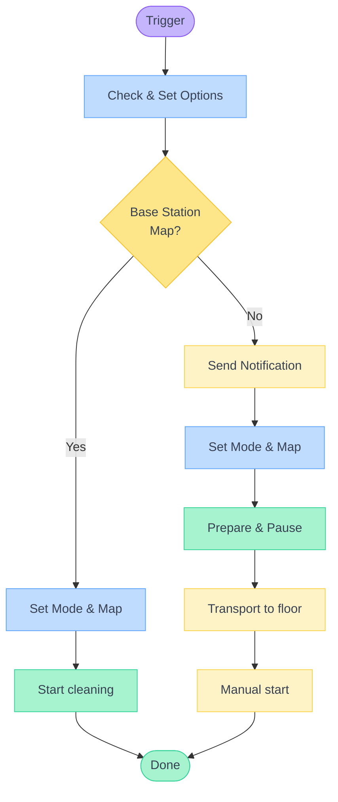

# 🤖 Dreame Vacuum – Multi-Floor Control

A Home Assistant blueprint for controlling Dreame vacuums across multiple floors. Supports scheduled cleaning with automatic transport notifications and manual control via buttons or other triggers.

## ✨ Features

🤖 Auto-detection of vacuum entities (select vacuum, rest detected automatically) 
📅 Per-map schedules with sweep/mop modes (3 maps, 6 schedules) 
🔔 Notification workflow with action buttons for transport 
👥 Multi-recipient notifications with presence checking 
🏠 Segment-based cleaning with configurable repeats 
✨ Optional customised cleaning using room settings from Dreame app 
⚠️ Safety checks: schedule conflicts, dock status, mop readiness 
🗺️ Auto-discard temporary maps for seamless multi-floor operation 
🐛 Debug mode with timing measurements

## 📋 Requirements

- Home Assistant ≥ 2024.10.0
- [Dreame Vacuum Integration](https://github.com/Tasshack/dreame-vacuum) ≥ v2.0.0b19
- At least one saved map configured
- Optional: Schedule helpers for time-based automation
- Optional: Mobile app for notifications

## 💾 Installation

Or manually: **Settings** → **Automations & Scenes** → **Blueprints** → **Import Blueprint**

## 🚀 Quick Start

1. Create automation from blueprint
2. Select your vacuum entity
3. Configure triggers for the functions you need
4. Save and test

Related entities (status, mode, map, camera) are auto-detected.

## 🔄 Workflows

<b>Workflow Overview</b>

### 🚿 Preparation Workflow

For maps without a base station, the robot prepares at the dock and pauses for transport.

**Sweep + Mop mode:**
1. Robot washes mop at base station
2. Robot starts and undocks
3. After a short delay, robot pauses automatically
4. Transport robot to target floor
5. Press button or notification action to resume

**Sweep only mode:**
Steps 1 is skipped – robot starts directly and pauses for pickup.

> [!NOTE]
> The delay before pausing allows the robot to move away from charging contacts for easier pickup. See [Timeouts](#-timeouts) for configuration.

### 💧 Mop Readiness Check

Before starting **Sweep + Mop** mode, the blueprint verifies:
- Mop pads are installed (`sensor.*_mop_pad` = "installed")
- Water tank is not empty (`sensor.*_low_water_warning` = "no_warning")

**If not ready:**
- Scheduled cleaning sends a warning notification with "Start Sweep Only" option
- Manual start shows a persistent notification and aborts

This prevents failed cleaning attempts when hardware isn't ready.

### 📅 Scheduled Cleaning

The core workflow for time-based cleaning across floors.

**Base station maps:** Schedule triggers → Robot cleans immediately.

**Other maps:**
1. Schedule triggers → Notification with "Prepare Robot" / "Skip"
2. Confirm → Robot prepares and pauses (see [Preparation Workflow](#-preparation-workflow))
3. Pickup notification → Transport robot
4. Press "Start Cleaning" → Robot resumes

**Conflict handling:** Only one schedule runs at a time. New schedules abort silently if robot is busy.

Schedule helpers let you define when cleaning should start. Create them via **Settings** → **Helpers** → **Schedule**. See [Schedule helper documentation](https://www.home-assistant.io/integrations/schedule/).

### 🔘 Manual Control

Direct control via buttons, switches, or other triggers.

| Function | Description |
|----------|-------------|
| **Sweep Only Mode** | Sets cleaning mode to sweep-only for quick cleaning without mopping. |
| **Sweep + Mop Mode** | Sets cleaning mode with mop enabled for full cleaning. |
| **Smart Start/Pause/Resume** | Context-aware control – adapts to robot status. See details below. |
| **Map 1 / Map 2 / Map 3** | Switches between floor maps for multi-floor setups. |

#### Smart Start/Pause/Resume

Adapts automatically based on robot status:

| Robot Status | Current Map | Action |
|--------------|-------------|--------|
| Cleaning | Any | Pause immediately |
| Paused | Any | Resume cleaning |
| Idle (docked) | Base station map | Start cleaning |
| Idle (docked) | Other map | Run [Preparation Workflow](#-preparation-workflow) |

### ⚡ Trigger Setup

Use any Home Assistant trigger type. MQTT and device triggers auto-detect action values from the payload.

> [!WARNING]
> For state or event triggers, you must set a **Trigger ID** manually (e.g., `fn_start`, `fn_sweep_mode`). Without an ID, the automation cannot determine which function to execute.

## ⏱️ Timeouts

The blueprint uses timeouts to handle robot state transitions reliably.

| Timeout | Default | Purpose |
|---------|---------|---------|
| **Start Timeout** | 120s | Max wait for robot to begin cleaning after start command |
| **Moistening Timeout** | 60s | Max wait for mop washing to complete (sweep+mop mode) |
| **Pause Delay** | 4.5s | Delay before pausing after undock – allows robot to clear charging contacts |

Adjust these in the blueprint configuration if your robot behaves differently.

## 🌐 Localisation

Customise notification texts in the Localisation section:
- Mode labels (Sweep/Mop)
- Button labels (Prepare, Skip, Start, Cancel, Sweep Only)
- Warning messages (Mop Not Ready)

Internal logic remains in English.

## 📝 Technical Notes

**Automation mode:** `queued` (max: 10) – required for button devices sending press + release events.

**Tested with:** Xiaomi X10+ (Dreame L10s Ultra and other supported models should work).

## 🔗 Links

- [Dreame Vacuum Integration](https://github.com/Tasshack/dreame-vacuum) – Required integration
- [Repository](https://github.com/errormastern/dreame-multifloor-control) – Source and releases
- [Issues](https://github.com/errormastern/dreame-multifloor-control/issues) – Bug reports and feature requests

---

**Licence:** MIT
